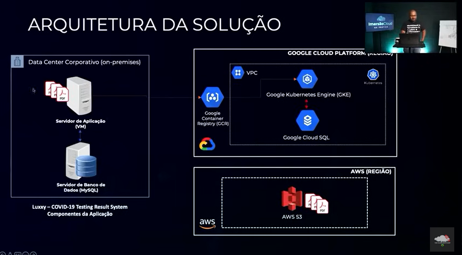

# Migração do Sistema de Hotel para Multi-Cloud


Este repositório abrange o processo de migração de um sistema de hotel para uma arquitetura multi-cloud, utilizando os serviços da AWS e Google Cloud. O sistema é responsável por validar e registrar hóspedes que apresentem resultados de teste de COVID-19 atualizados.

## Configuração da Instância

### Configuração do Usuário S3 na AWS

A primeira etapa envolve a criação e configuração de um novo usuário na AWS, concedendo acesso total ao serviço S3 e gerando chaves de acesso para esse usuário.

### Construção para Inicialização dos Serviços

1. Clone o projeto no terminal do Google Cloud:

    ```sh
    git clone git@github.com:ThreeDP/imersao_cloud.git
    ```

2. Importe o arquivo CSV de credenciais baixado da AWS.

3. Execute o arquivo `.environment` para obter as informações básicas do ambiente:

    ```sh
    source .enviroment
    ```

4. Execute o comando `make` para configurar as instâncias dos serviços necessários:

    ```sh
    make
    ```

## Implantação

### Declaração das Variáveis de Ambiente Necessárias

Crie um arquivo `.env` no diretório raiz do projeto com as seguintes variáveis:

```env
AWS_BUCKET=<luxxy-covid-testing-system-pdf-pt-xxxx>
S3_ACCESS_KEY=xxxxxxxxxxxxxxxxxx
S3_SECRET_ACCESS_KEY=xxxxxxxxxxxxxxxxxxxxxxxxxxxxxxxxxx
DB_HOST_NAME=<ip_publico_mysql>
DB_USER=<sql_user>
DB_PASSWORD=<sql_password>
DB_NAME=dbcovidtesting
DB_PORT=3306
```

### Criação do Usuário MySQL

Crie um usuário com as mesmas credenciais declaradas no `.env` e execute os seguintes comandos:

```sh
gcloud sql connect $SQL_INSTANCE --user=<user>
```
```sh
use dbcovidtesting;
source ~/imersao_cloud/requirements/db/create_table.sql
show tables;
exit;
```

### Criação da Imagem do App

Crie a imagem do aplicativo no Kubernetes, conecte-se à API, crie um arquivo de configuração de ambiente e aplique as configurações no Kubernetes:

```sh
make deploy
```

## Migração
### Upload do Dump do Banco de Dados

Faça o upload do banco de dados e migre os dados para o banco no Google Cloud:

```sh
make migrate
```

```sh
gcloud sql connect $SQL_INSTANCE --user=<user>
```

```sh
use dbcovidtesting;
source ~/imersao_cloud/requirements/db/db_dump.sql;
select * from records;
exit;
```
### Upload dos PDFs para o Bucket S3 da AWS

Abra a CLI da AWS e faça o download do zip contendo os PDFs:

```sh
wget https://drive.google.com/file/d/11RSmD0dXyavX_hixNI7VoCws3-ql-tEG/view?usp=drive_link
unzip pdf_files.zip
```

```sh
aws s3 sync . s3://luxxy-covid-testing-system-pdf-pt-xxxx
```

Projeto desenvolvido durante a Imersão Cloud na Prática da [The Cloud Bootcamp](https://thecloudbootcamp.com/pt/).